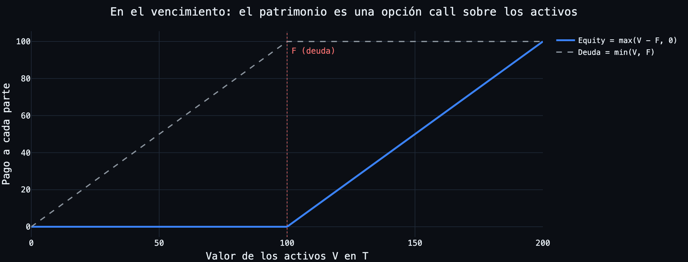
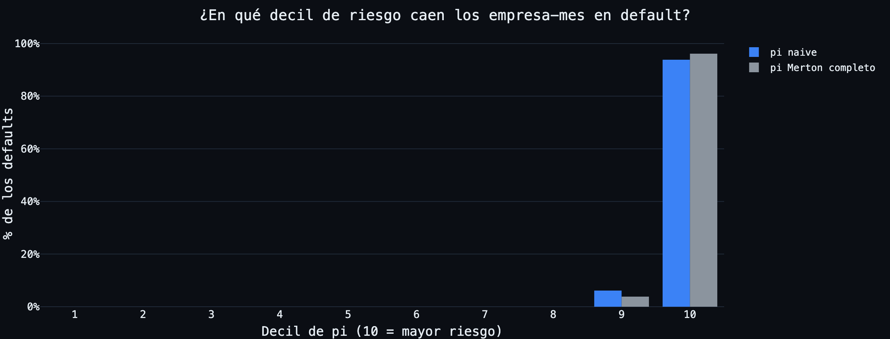
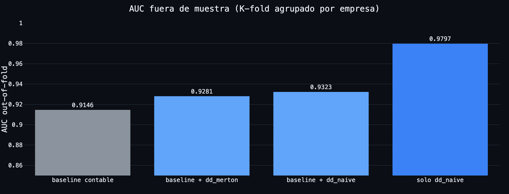
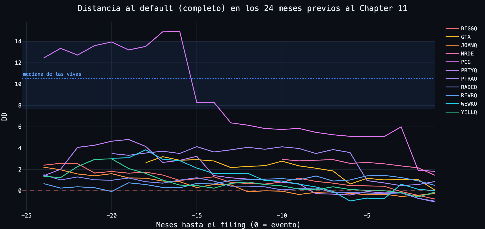
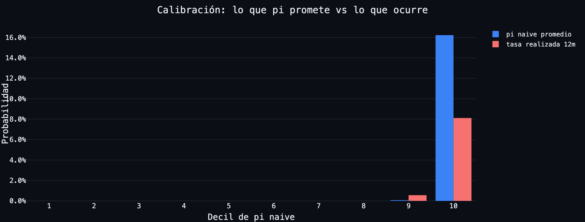

# Merton Distance to Default: réplica y extensión de Bharath & Shumway (2008)

Réplica reproducible del paper *"Forecasting Default with the Merton Distance to
Default Model"* (Bharath & Shumway, Review of Financial Studies 2008) sobre
empresas cotizadas de Estados Unidos, con datos 100% públicos y gratuitos, más
una extensión propia: baseline contable, señal incremental fuera de muestra,
casos de estudio con quiebras reales y nota de calibración.

**Investigación de portafolio. No es una herramienta de inversión ni asesoría.**

Dashboard: `uv run streamlit run app/streamlit_app.py`

---

## 1. El paper original

Merton (1974): el patrimonio de una empresa es una **opción call sobre sus
activos** con strike igual al valor de su deuda. De ahí sale la distancia al
default y una probabilidad:

```
DD = [ln(V/F) + (mu - 0.5 sigma_V^2) T] / (sigma_V sqrt(T))        pi = N(-DD)
```

V y sigma_V no se observan: el **modelo completo** los resuelve con el sistema
iterativo de Black-Scholes-Merton (el estándar Crosbie-Bohn / KMV). Bharath &
Shumway proponen un **modelo naive** con la misma forma funcional y cero
solución de sistemas: `V = E + F`, `sigma_V = (E/(E+F)) sigma_E +
(F/(E+F))(0.05 + 0.25 sigma_E)`, mu = retorno de la acción 12 meses.

Su hallazgo, contraintuitivo: **el naive predice default igual o ligeramente
mejor que el completo**. Lo valioso del Merton es su forma funcional, no la
solución precisa.



## 2. La réplica: qué hice y qué encontré

**Panel:** 14,821 empresa-mes (2016-2026), 134 empresas: 123 no financieras del
S&P 500 y **11 Chapter 11 verificados** (PG&E, Garrett Motion, Revlon, Party
City, Lordstown, Yellow, Proterra, Rite Aid, WeWork, Joann, Big Lots). Precios
de yfinance con fallback de stockanalysis.com para deslistadas; deuda, acciones
y ROA de SEC EDGAR (companyfacts, point-in-time por fecha de publicación, sin
lookahead); T-bill de FRED. Convención del paper: `F = deuda corriente + 0.5 x
deuda de largo plazo`. Todo se cachea localmente y se reconstruye con
`scripts/build_data.py`, `build_model.py`, `build_validation.py` y
`build_mejora.py`.

**El test central** (etiqueta: Chapter 11 en los 12 meses siguientes; sin filas
post-filing; muestra idéntica para ambos modelos):

| | naive | Merton completo |
|---|---|---|
| AUC (IC95, bootstrap por empresa) | **0.9834** [0.973, 0.993] | 0.9804 [0.961, 0.994] |
| Accuracy ratio (CAP) | 0.967 | 0.961 |
| % de defaults capturado por el decil 10 | 93.8% | 96.2% |
| pseudo-R2 del logit (SE cluster) | 0.522 | 0.517 |



**Resultado: se replica la sustancia del hallazgo del paper.** La diferencia de
AUC (+0.0030, IC95 [-0.0042, +0.0139], probabilidad bootstrap de naive >=
completo: 65%) es un **empate estadístico**, y el leave-one-out muestra que su
signo depende de una sola firma (PG&E). En el logit conjunto ninguno de los dos
DD es significativo y añadir el completo al naive mueve el pseudo-R2 de 0.522 a
0.526: llevan la misma información. **La solución iterativa no añade poder
predictivo sobre la forma funcional.** Las 11 quiebras estaban en el decil 10
de riesgo un mes antes del filing según ambos modelos.

## 3. La mejora: lo que preguntaría un equipo de riesgo

**¿El DD aporta algo sobre un baseline contable?** Logit tipo Shumway (2001)
con apalancamiento, tamaño, retorno 12m, volatilidad y ROA, evaluado fuera de
muestra con K-fold agrupado por empresa (cada fold: una quebrada + su cuota de
vivas; ninguna firma se predice con información de sí misma):

| modelo | AUC out-of-fold |
|---|---|
| baseline contable | 0.9146 |
| baseline + DD naive | 0.9323 |
| **DD naive solo** | **0.9797** |



Dos respuestas: (1) **sí, el DD aporta señal incremental** (+0.018 de AUC sobre
el baseline; su z in-sample de -0.83 no es significativo, pero con 11 clusters
de eventos y colinealidad estructural era lo esperable); (2) el hallazgo
incómodo: **el DD solo generaliza mejor que el modelo conjunto**. Con 11
eventos, cada parámetro extra se paga fuera de muestra: la forma funcional del
Merton ya condensa apalancamiento y volatilidad mejor que un logit que intenta
recombinarlos.

**¿El DD vio venir las quiebras?** El gráfico estrella: DD de cada quebrada en
los 24 meses previos al filing, contra la banda de las vivas.



Las minoristas sobre-endeudadas alertaron con más de un año: Rite Aid y Revlon
24+ meses (nunca estuvieron sanas en la ventana), Joann 23, Big Lots 21, Yellow
18, Party City y WeWork 14. Los casos donde el modelo llega tarde enseñan sus
límites: **PG&E** (2 meses: el mercado esperaba, correctamente, que el equity
sobreviviera al Chapter 11), **Lordstown** (1-4 meses: quebró con caja y sin
deuda por el pleito con Foxconn, un default estratégico que ningún modelo
estructural puede ver) y **WeWork** (su pasivo real eran arriendos operativos,
invisibles para los tags de deuda de XBRL).

**¿pi es una probabilidad?** No. La tasa realizada de default a 12 meses del
panel es 0.90%; el pi naive promedio (1.69%) la sobreestima 1.9x y el del
completo (0.66%) la subestima. En el decil 10 el naive promete 16.2% y ocurre
8.1%. **N(-DD) ordena bien, pero no está calibrada: se usa como ranking, no
como PD literal.**



## 4. Resultados en una frase, y lo que NO dicen

> El modelo naive de Bharath & Shumway empata con el Merton completo en este
> panel (y el signo del empate depende de una firma): lo valioso del Merton es
> su forma funcional. El DD añade señal sobre los ratios contables fuera de
> muestra, las quiebras apalancadas se veían venir con más de un año, y N(-DD)
> no es una probabilidad calibrada.

Honestidad estadística (detalle en `docs/bitacora_fase*.md`):

- **Los niveles no son comparables con el paper** (AUC ~0.98 aquí vs accuracy
  ratios ~0.65-0.87 en B&S): separar mega-caps sobrevivientes del S&P 500 de 11
  quebradas OTC en colapso es casi trivial, y ese techo comprime las
  diferencias entre modelos. Solo la comparación interna es válida.
- **El N efectivo son 11 eventos**, no 130 empresa-mes positivos: bootstrap por
  empresa, K-fold agrupado y SE cluster lo asumen, y aun así la inferencia fina
  es frágil.
- **Sesgo de disponibilidad:** las fuentes gratuitas purgan los tickers
  deslistados; la cohorte COVID 2020 (J.C. Penney, Hertz, Chesapeake, Whiting,
  Frontier) se perdió casi entera y BBBY resultó ser otra empresa con el ticker
  reciclado.
- **Sesgo de supervivencia** en las vivas (el S&P 500 actual son las ganadoras)
  y deuda de XBRL que no captura arriendos operativos (WeWork).

## Reproducir

```bash
uv sync
uv run pytest                              # 46 tests
export SEC_USER_AGENT="Tu Nombre tu@correo.com"   # EDGAR lo exige para descargar
uv run python scripts/build_data.py        # ingesta (cachea todo en data/cache)
uv run python scripts/build_model.py       # DD completo + naive por empresa-mes
uv run python scripts/build_validation.py  # la réplica: deciles, AUC, bootstrap, logit
uv run python scripts/build_mejora.py      # baseline, señal incremental, casos, calibración
uv run python scripts/build_figuras.py     # figuras del README
uv run python scripts/build_publico.py     # subconjunto versionado para el deploy
uv run streamlit run app/streamlit_app.py  # dashboard
```

El cache completo (~515 MB, sobre todo companyfacts crudos de EDGAR) no se
versiona: se reconstruye con los scripts. Lo que el dashboard necesita para
correr sin él vive en `data/publico/` (1.8 MB), y por eso la app puede
desplegarse tal cual.

Estructura: `data/` ingesta (EDGAR, yfinance, FRED, con cache Parquet),
`model/` matemática pura sin red (Black-Scholes, solver iterativo con Newton
vectorizado, naive), `validation/` réplica y mejora, `app/` dashboard,
`tests/` pytest. Las decisiones de cada fase, con sus porqués y los hallazgos
de las revisiones adversariales, están en `docs/bitacora_fase1.md` a
`bitacora_fase4.md`.

---

*Carlos Chapman, 2026. Datos: SEC EDGAR, Yahoo Finance, stockanalysis.com,
FRED. Paper: Bharath, S. y Shumway, T. (2008), "Forecasting Default with the
Merton Distance to Default Model", Review of Financial Studies 21(3).*
